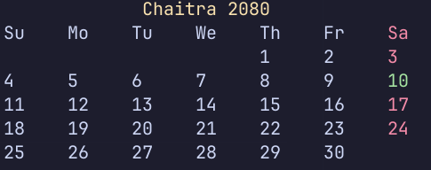

# ncal

A small Nepali calendar program in the terminal.



Still a work-in-progress!

## Installation

Download [Crystal](https://crystal-lang.org) for your system.

Then clone the repo and build the app.

```bash
git clone https://github.com/pes18fan/ncal
cd ncal
shards build ncal
```

`ncal` will be built in the folder `./bin/ncal`.

## Contributing

1. Fork it (<https://github.com/pes18fan/ncal/fork>)
2. Create your feature branch (`git checkout -b my-new-feature`)
3. Commit your changes (`git commit -am 'Add some feature'`)
4. Push to the branch (`git push origin my-new-feature`)
5. Create a new Pull Request

## Contributors

- [pes18fan](https://github.com/pes18fan) - creator and maintainer
